# CodePulse Backend

### Push-triggered, context-aware AI code analysis for GitHub.

Connect a repository branch once. Every subsequent push to that branch refreshes RAG embeddings and runs a multi-agent LangGraph review pipeline — producing structured findings with severity, domain ratings, and measurable quality signals.

---

## Table of contents

1. [Product overview](#1-product-overview)
2. [Architecture](#2-architecture) *(system + module diagrams)*
3. [End-to-end flows](#3-end-to-end-flows) *(journey, sequence, decision charts)*
4. [Authentication](#4-authentication) *(OAuth sequence)*
5. [API reference](#5-api-reference)
6. [Data model](#6-data-model) *(ER + status lifecycle)*
7. [AI analysis pipeline](#7-ai-analysis-pipeline) *(graph + assembler flow)*
8. [Metrics & measurements](#8-metrics--measurements) *(quality gate chart)*
9. [Configuration & limits](#9-configuration--limits)
10. [Local setup & testing](#10-local-setup--testing)
11. [Permissions & webhooks](#11-permissions--webhooks)
12. [Project structure](#12-project-structure)
13. [Roadmap](#13-roadmap)

---

## 1. Product overview

### What CodePulse does

| Capability | Description |
|---|---|
| **Branch connect** | User picks a GitHub repo + branch; system registers a push webhook, then indexes the branch into vector embeddings |
| **Push analysis** | On each push to the connected branch: incremental re-index → compare `before..after` → multi-agent review |
| **Structured report** | Domain ratings (1–5), findings with severity, deduped/capped issue list, related-context counts |
| **Run history** | Every analysis run is persisted and queryable by branch |

### What it is not

- Not a PR reviewer (push/changeset based)
- Not a linter substitute (AI reasoning over diffs + repo context)
- Not email/password auth (GitHub OAuth only)

### Tech stack

| Layer | Technology | Role |
|---|---|---|
| API | NestJS (TypeScript) | HTTP, auth, orchestration |
| AI graph | LangGraph | Stateful multi-agent pipeline |
| LLM | Google Gemini | Domain reviews + bug detection |
| Embeddings | Gemini Embedding API | Chunk vectors for RAG |
| Database | MongoDB (+ Atlas Vector Search) | Users, index metadata, vectors, runs |
| SCM | GitHub REST + webhooks | OAuth, compare, hooks, contents |

---

## 2. Architecture

### System context

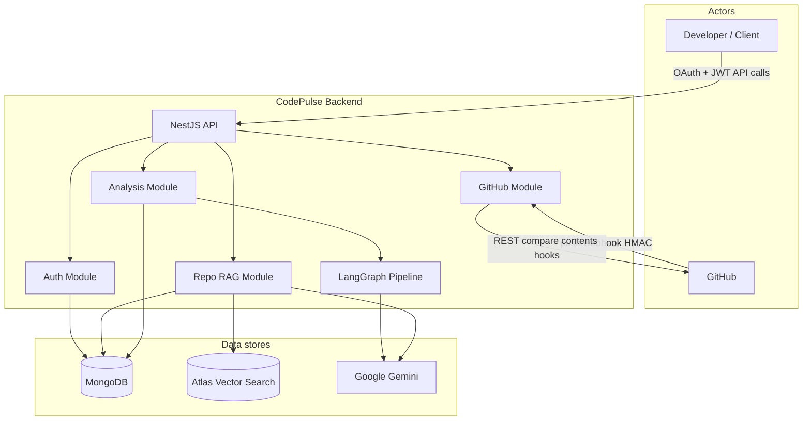

### Internal module layout

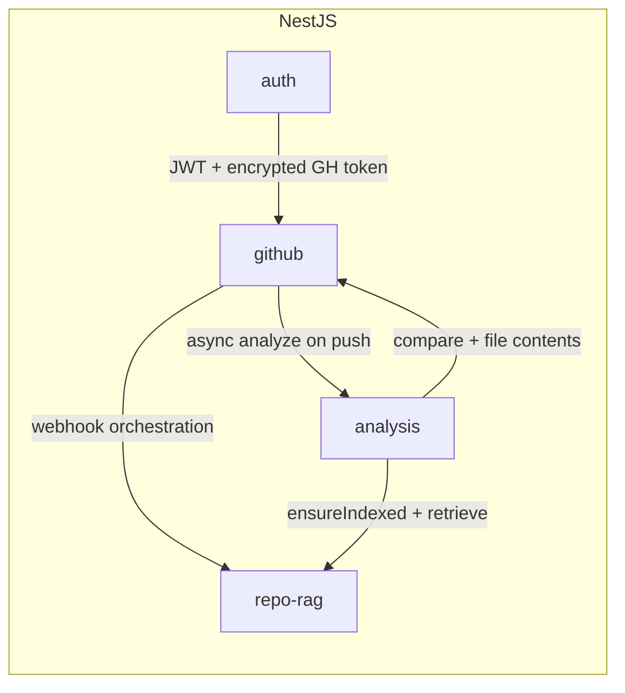

### High-level request paths

```
┌─────────────────────────────────────────────────────────────────────┐
│                         NestJS Backend                              │
│                                                                     │
│  Auth (GitHub OAuth + JWT)                                          │
│  GitHub (slim discover APIs + HMAC webhook)                         │
│  Repo RAG (chunk → embed → vector store → retrieve)                 │
│  Analysis (LangGraph pipeline + PushAnalysisRuns)                   │
└───────────────────────────────┬─────────────────────────────────────┘
                                │
                                ▼
┌─────────────────────────────────────────────────────────────────────┐
│                     LangGraph analysis pipeline                     │
│                                                                     │
│  inputGuard → retriever → ┬─ qualityReview ────┐                    │
│                           ├─ securityReview ───┼→ join → bugDetect  │
│                           └─ performanceReview─┘         → assembler│
└─────────────────────────────────────────────────────────────────────┘
```

### Module map

| Module | Responsibility |
|---|---|
| `auth/` | JWT strategy, `/me`, GitHub user upsert |
| `github/` | OAuth, slim repos/branches/profile, webhook verify |
| `repo-rag/` | Indexing, embeddings, vector store, retrieval |
| `analysis/` | Push analysis service, LangGraph graph, run persistence |

---

## 3. End-to-end flows

### 3.1 Product journey (overview)

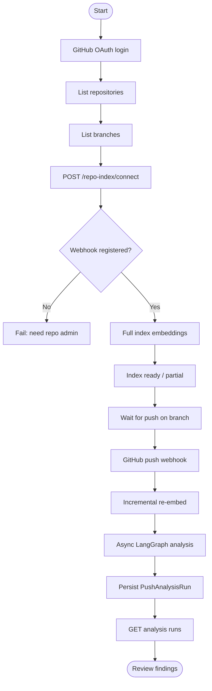

### 3.2 Connect (one-time per workspace/branch)

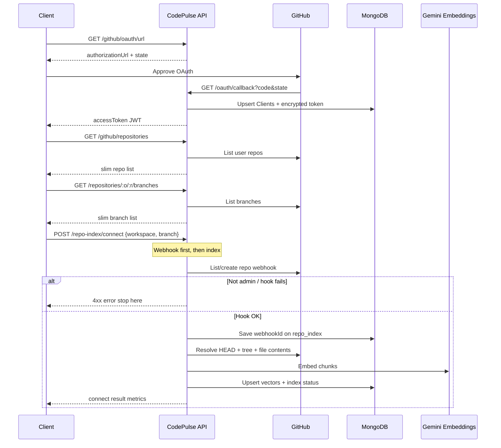

Text checklist:

```
Client
  → GET  /github/oauth/url → browser OAuth → callback → app JWT
  → GET  /github/repositories                  (slim)
  → GET  /github/repositories/:o/:r/branches   (slim)
  → POST /repo-index/connect { workspace, branch }
        1) Register GitHub push webhook (must succeed first)
        2) Full-index branch (chunk → embed → store)
  → GET  /repo-index/.../status                (ready | partial | …)
```

### 3.3 Push analysis (every commit to connected branch)

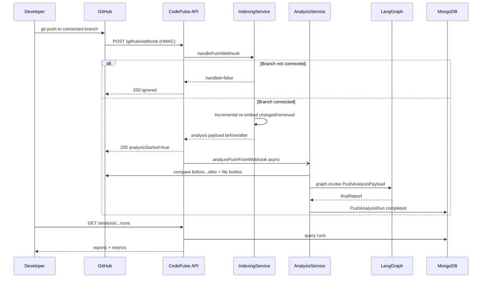

### 3.4 Connect decision (webhook before index)

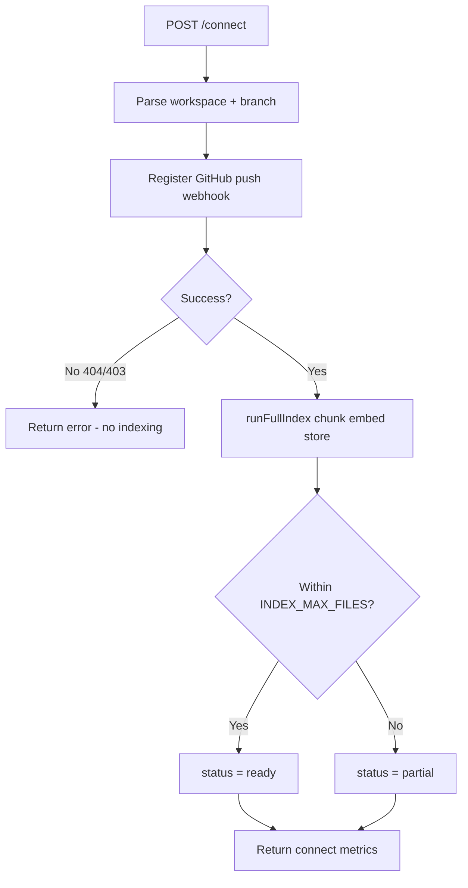

Webhook registration runs **before** indexing. If webhook creation fails (e.g. collaborator without admin), indexing does **not** start.

---

## 4. Authentication

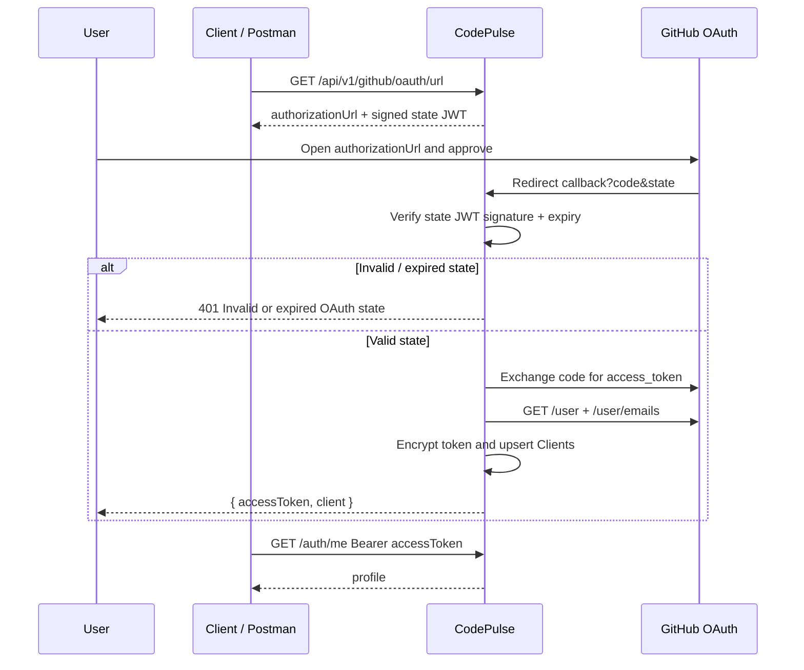

| Item | Detail |
|---|---|
| Provider | GitHub OAuth 2.0 only |
| Session | App JWT (`Authorization: Bearer <token>`) |
| Token storage | GitHub access token encrypted at rest (`GITHUB_TOKEN_ENCRYPTION_KEY`) |
| Default scopes | `read:user user:email repo` |
| Webhook admin | Creating hooks requires **repo admin** (GitHub returns 404 for collaborators) |

### Auth endpoints

| Method | Path | Auth | Description |
|---|---|---|---|
| `GET` | `/api/v1/github/oauth/url` | Public | Returns `{ authorizationUrl, state }` |
| `GET` | `/api/v1/github/oauth/callback` | Public | Exchanges `code`+`state` → `{ accessToken, client }` |
| `GET` | `/api/v1/auth/me` | JWT | Current app user profile |

**OAuth state tip:** Always open a **fresh** `authorizationUrl` from `/oauth/url`. Stale URLs or restarting the server with a changed `JWT_SECRET` causes `Invalid or expired OAuth state`. No Mongo user is written until callback succeeds.

---

## 5. API reference

### 5.1 Discover (slim GitHub DTOs)

| Method | Path | Auth | Returns (only these fields) |
|---|---|---|---|
| `GET` | `/api/v1/github/profile` | JWT | `id`, `login`, `name?`, `avatarUrl?` |
| `GET` | `/api/v1/github/repositories?page&perPage` | JWT | `{ items: [{ fullName, owner, name, private, defaultBranch, updatedAt }], page, perPage }` |
| `GET` | `/api/v1/github/repositories/:owner/:repo/branches` | JWT | `{ items: [{ name, protected, commitSha? }], page, perPage }` |

Raw GitHub compare/file/contents APIs are **internal** (used by indexing/analysis), not exposed to clients.

### 5.2 Connect & index

| Method | Path | Auth | Description |
|---|---|---|---|
| `POST` | `/api/v1/repo-index/connect` | JWT | Webhook first, then full index |
| `GET` | `/api/v1/repo-index/repositories/:owner/:repo/branches/:branch/status` | JWT | Index health |

**Connect body**

```json
{
  "workspace": "owner/repo",
  "branch": "main"
}
```

Optional: `webhookUrl` overrides `PUBLIC_WEBHOOK_URL`.

**Connect success (shape)**

| Field | Meaning |
|---|---|
| `workspace` | `owner/repo` |
| `branch` | Watched branch |
| `indexStatus` | `ready` \| `partial` \| … |
| `indexedSha` | HEAD SHA indexed |
| `fileCount` | Files successfully embedded |
| `chunkCount` | Total chunks stored |
| `webhookId` | GitHub hook id |
| `webhookUrl` | Public callback URL registered |
| `message` | Human-readable outcome |

### 5.3 Webhook

| Method | Path | Auth | Description |
|---|---|---|---|
| `POST` | `/api/v1/github/webhook` | `X-Hub-Signature-256` | Push events only; others ignored |

**Webhook response (typical)**

| Field | Meaning |
|---|---|
| `ok` | Signature valid / processed |
| `handled` | Branch was connected |
| `changed` / `removed` | Path counts from commits |
| `analysisStarted` | Async analysis kicked off |

### 5.4 Analysis runs

| Method | Path | Auth | Description |
|---|---|---|---|
| `GET` | `/api/v1/analysis/repositories/:owner/:repo/branches/:branch/runs` | JWT | Run history (newest first) |
| `GET` | `/api/v1/analysis/repositories/:owner/:repo/runs/:runId` | JWT | Single run + `finalReport` |

---

## 6. Data model

### Entity relationship (conceptual)

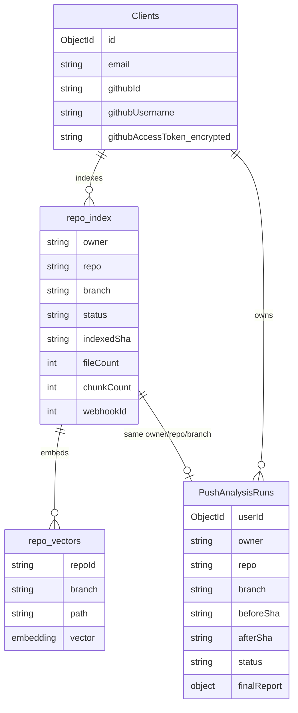

### Collections

| Collection | Purpose |
|---|---|
| `Clients` | GitHub-authenticated users + encrypted access token |
| `repo_index` | Per `owner/repo/branch` index metadata + webhook ids |
| `repo_vectors` (Atlas) | Embedded chunks for RAG |
| `PushAnalysisRuns` | Analysis run status + `finalReport` |

### Index status lifecycle

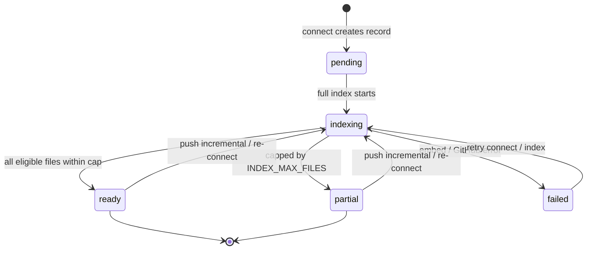

### Index status matrix

| Status | Meaning | Analysis allowed? |
|---|---|---|
| `pending` | Record created, not indexed yet | No |
| `indexing` | Full or incremental job in progress | No (conflict if analyze waits on ready) |
| `ready` | Index complete within file cap | Yes |
| `partial` | Eligible files exceeded `INDEX_MAX_FILES`; capped subset indexed | Yes (with reduced coverage) |
| `failed` | Last job errored (`lastError` set) | No until re-indexed |
| `missing` | Status API when no record exists | No |

### Run status matrix

| Status | Meaning |
|---|---|
| `running` | Graph invoked / in progress |
| `completed` | `finalReport` written |
| `failed` | `error` message stored |

---

## 7. AI analysis pipeline

### Graph topology

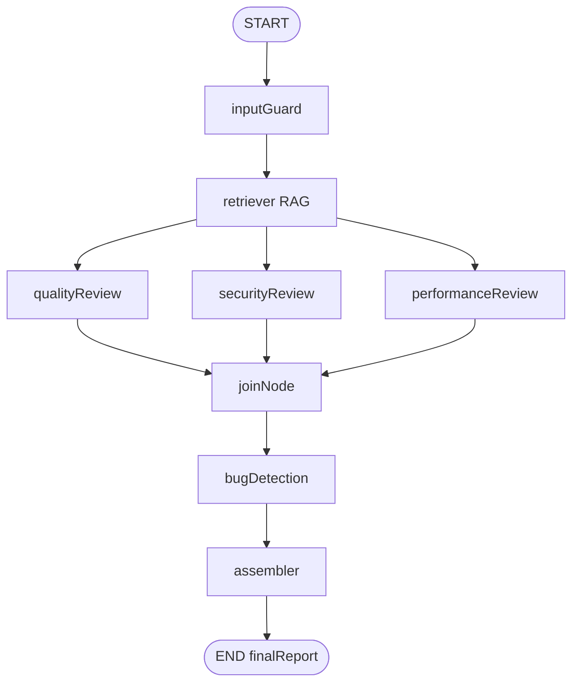

### Indexing → retrieval → review data flow

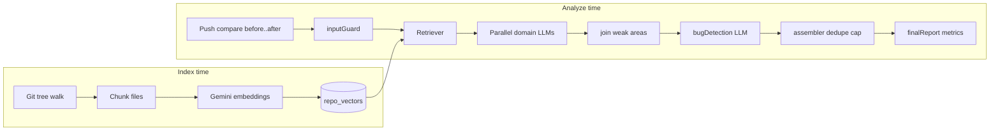

### Assembler post-processing

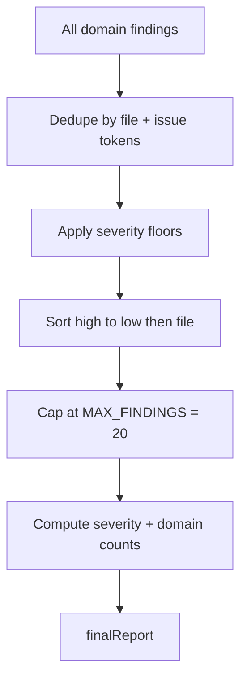

```
inputGuard → retriever → [quality | security | performance] → joinNode → bugDetection → assembler
```

| Node | Responsibility | Output signals |
|---|---|---|
| `inputGuard` | Drop empty files (no patch/content) | Cleaned file list |
| `retriever` | RAG: imports, tests, siblings, semantic search | `relatedContextCount`, formatted context |
| `qualityReview` | Maintainability, naming, API consistency | Domain rating + findings |
| `securityReview` | Authn/z, injection, secrets, redirects | Domain rating + findings |
| `performanceReview` | N+1, hot paths, complexity | Domain rating + findings |
| `joinNode` | Weak-area shaping for bug detection | Prompt addendum |
| `bugDetection` | Correctness / edge cases guided by weak areas | Domain rating + findings |
| `assembler` | Dedupe, severity floors, rank, cap at 20 | `finalReport` |

### Domain report schema (per domain)

| Field | Type | Description |
|---|---|---|
| `domain` | enum | `quality` \| `security` \| `performance` \| `bugDetection` |
| `rating` | `1–5` | Higher = healthier in that domain |
| `summary` | string | Short domain assessment |
| `weakAreas` | string[] | Fragile areas (feeds bug detection) |
| `findings[]` | objects | `file`, `issue`, `severity`, `suggestion?` |

### Finding severity

| Severity | Rank | Typical examples |
|---|---|---|
| `high` | 3 | Injection, missing auth, hardcoded secrets (floored upward when matched) |
| `medium` | 2 | N+1 patterns, null deref risk, off-by-one |
| `low` | 1 | Naming / style / minor maintainability |

Assembler also applies **severity floors** for high-risk phrases (e.g. SQL injection, open redirect, missing auth).

---

## 8. Metrics & measurements

CodePulse exposes measurable signals at three layers: **index**, **retrieval**, and **analysis report**. Use these for dashboards, gates, and trend tracking.

### 8.1 Index / RAG coverage metrics

| Metric | Source | Unit | How to read it |
|---|---|---|---|
| `fileCount` | `repo_index` / connect response | files | Number of files successfully embedded |
| `chunkCount` | `repo_index` / connect response | chunks | Total vector chunks (higher ≈ denser context) |
| `indexedSha` | `repo_index` | git SHA | Commit the index represents |
| `status` | `repo_index` | enum | See [index status matrix](#index-status-matrix) |
| `totalEligibleFiles` | connect/index logs | files | Blobs that passed `shouldIndex` |
| `cappedAt` | index result | files | Equals `INDEX_MAX_FILES` when truncated |
| Coverage ratio | `fileCount / totalEligibleFiles` | 0–1 | `< 1` means partial index under file cap |
| Chunk density | `chunkCount / fileCount` | chunks/file | Typical 2–15 depending on language/size |
| `lastIndexedAt` | `repo_index` | timestamp | Freshness of embeddings |
| Webhook attached | `webhookId` present | bool | Push automation armed |

**Suggested health thresholds (starting points)**

| Signal | Healthy | Warning | Critical |
|---|---|---|---|
| Index `status` | `ready` | `partial` | `failed` / `missing` |
| Coverage ratio | ≥ 0.9 | 0.5–0.9 | < 0.5 |
| Time since `lastIndexedAt` | < 24h on active branches | 1–7d | > 7d without pushes |

### 8.2 Retrieval (per analysis) metrics

| Metric | Source in `finalReport` | Unit | Meaning |
|---|---|---|---|
| `relatedContextCount` | report field | chunks | How many non-diff chunks fed to reviewers |
| `relatedContextPaths` | report field (up to 12) | paths | Sample of files used as context |
| Changed files analyzed | input / logs | files | Files surviving `inputGuard` |
| Retrieval budget | code constant | ~6000 chars | Soft cap on assembled related context |
| Max chunks per path | code constant | 3 | Prevents one file dominating context |

**Interpretation**

| `relatedContextCount` | Interpretation |
|---|---|
| `0` | Index missing/empty or no related hits — reviews are diff-only (noisier / less precise) |
| `1–20` | Light context |
| `20–80` | Typical healthy retrieval |
| Very high | May hit budget early; prefer path diversity over volume |

### 8.3 Analysis quality metrics (report)

| Metric | Path | Unit | Meaning |
|---|---|---|---|
| Domain rating | `domainReports.<domain>.rating` | 1–5 | Domain health for this push |
| Domain finding count | `counts.domain.<domain>` | count | Raw findings before global cap (per domain agent) |
| Severity histogram | `counts.severity.{high,medium,low}` | count | Distribution after assemble |
| Total findings | `allFindings.length` (≤ 20) | count | Final actionable list |
| Dedupe ratio | `rawFindings / uniqueFindings` (logs: `raw` vs `unique`) | ratio | >1 means cross-domain overlap removed |
| Overall summary | `overallSummary` | string | Human rollup of severity counts |

**Domain rating scale**

| Rating | Label | Suggested use |
|---|---|---|
| 5 | Excellent | Informational only |
| 4 | Good | Merge/push OK |
| 3 | Acceptable | Review medium findings |
| 2 | Weak | Block on high or many medium |
| 1 | Poor | Treat as failed quality gate |

**Composite score (recommended formula for dashboards)**

\[
\text{Composite} = 0.30\,R_q + 0.30\,R_s + 0.20\,R_p + 0.20\,R_b
\]

Where \(R_q, R_s, R_p, R_b\) are quality / security / performance / bugDetection ratings.

| Composite | Gate suggestion |
|---|---|
| ≥ 4.0 | Pass |
| 3.0 – 3.9 | Pass with review |
| 2.0 – 2.9 | Warn / require ack |
| < 2.0 | Fail |

**Severity gate examples**

| Policy | Rule |
|---|---|
| Strict | Fail if `counts.severity.high ≥ 1` |
| Balanced | Fail if `high ≥ 1` OR (`medium ≥ 5` AND composite < 3) |
| Soft | Fail only if `high ≥ 3` |

### Quality gate decision flow (suggested)

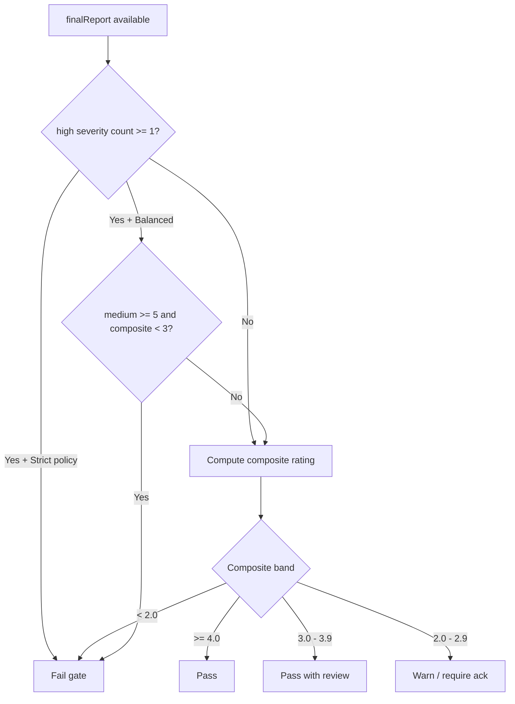

### 8.4 Pipeline / ops metrics (from logs)

Log prefixes: `[repo-index]`, `[embeddings]`, `[analysis]`, `[github-webhook]`.

| Metric | How observed | Notes |
|---|---|---|
| Full index duration | timestamps around `full index started/complete` | Dominated by embed rate limits |
| Incremental update size | `changed=N removed=M` | Cost proxy per push |
| Embed retries | `[embeddings] rate limited, retry k/4` | Gemini free-tier pressure |
| Failed embed files | `failed=N` in index complete line | Partial quality loss |
| Analysis wall time | `analyze started` → `graph complete` | Includes 4 LLM domain calls + bug detection |
| Findings compression | `raw=X unique=Y` in assembler log | Dedupe effectiveness |
| Webhook → analysis skip | `branch-create` / zero `before` SHA | First push / branch create |

**LLM call count per push analysis (nominal)**

| Call | Parallel? |
|---|---|
| qualityReview | Yes (wave 1) |
| securityReview | Yes (wave 1) |
| performanceReview | Yes (wave 1) |
| bugDetection | No (after join) |
| **Total** | **4 LLM invocations** (+ embedding calls on index paths) |

### 8.5 Measurement matrix (quick reference)

| Layer | Key KPIs | Stored where |
|---|---|---|
| Connect | webhook success, `fileCount`, `chunkCount`, `status` | `repo_index`, connect JSON |
| Push ingest | changed/removed counts, analysisStarted | webhook JSON + logs |
| Retrieval | `relatedContextCount`, paths | `finalReport` |
| Quality | ratings, severity counts, capped findings | `PushAnalysisRuns.finalReport` |
| Reliability | run `status`, index `failed`, embed 429s | DB + logs |

### 8.6 Example `finalReport` measurement block

```json
{
  "owner": "acme",
  "repo": "api",
  "branch": "main",
  "beforeSha": "abc…",
  "afterSha": "def…",
  "overallSummary": "Found 12 issues (high: 3, medium: 5, low: 4).",
  "counts": {
    "severity": { "high": 3, "medium": 5, "low": 4 },
    "domain": {
      "quality": 4,
      "security": 3,
      "performance": 5,
      "bugDetection": 6
    }
  },
  "domainReports": {
    "quality": { "domain": "quality", "rating": 3, "summary": "…", "findings": [] },
    "security": { "domain": "security", "rating": 2, "summary": "…", "findings": [] },
    "performance": { "domain": "performance", "rating": 4, "summary": "…", "findings": [] },
    "bugDetection": { "domain": "bugDetection", "rating": 2, "summary": "…", "findings": [] }
  },
  "allFindings": [],
  "relatedContextCount": 42,
  "relatedContextPaths": ["src/auth/guard.ts", "src/users/service.ts"]
}
```

From this example:

| Derived metric | Value |
|---|---|
| Composite rating | \(0.3\times3 + 0.3\times2 + 0.2\times4 + 0.2\times2 = 2.7\) → warn band |
| High severity | 3 → fail under strict policy |
| Context richness | 42 chunks → healthy retrieval |

---

## 9. Configuration & limits

### Environment variables

| Variable | Required | Default / example | Purpose |
|---|---|---|---|
| `PORT` | no | `3000` | HTTP port |
| `MONGODB_URI` | yes | Atlas / local URI | Primary DB |
| `JWT_SECRET` | yes | strong secret | App JWT + OAuth state |
| `JWT_ACCESS_TOKEN_TTL` | yes | `15m` | Access token lifetime |
| `GITHUB_CLIENT_ID` / `SECRET` | yes | OAuth app | Login |
| `GITHUB_CALLBACK_URL` | yes | `…/oauth/callback` | Must match GitHub app settings |
| `GITHUB_TOKEN_ENCRYPTION_KEY` | yes | 64 hex chars | Encrypt stored GH tokens |
| `GITHUB_OAUTH_SCOPES` | no | `read:user user:email repo` | OAuth scopes |
| `GITHUB_WEBHOOK_SECRET` | yes | shared secret | HMAC verify |
| `PUBLIC_WEBHOOK_URL` | yes | ngrok / prod URL | Hook registered on connect |
| `GEMINI_API_KEY` | yes | — | LLM + embeddings |
| `GEMINI_MODEL` | no | `gemini-2.0-flash` | Review model (factory may pin flash) |
| `EMBEDDING_MODEL` | no | `gemini-embedding-001` | Embeddings |
| `EMBEDDING_DIMS` | no | `768` | Vector dimensionality |
| `VECTOR_INDEX_NAME` | no | `repo_vectors_index` | Atlas vector index name |
| `INDEX_MAX_FILES` | no | `1000` | Max files per full index |

### Hard limits (code constants)

| Limit | Value | Location / effect |
|---|---|---|
| Max indexed file size | 500 KB | Larger blobs skipped |
| Chunk text cap | ~3000 chars | Truncates oversized chunks |
| Findings per domain (prompt rule) | ≤ 8 | Prompt constraint |
| Final findings cap | 20 | Assembler |
| Related context budget | ~6000 chars | Retrieval assembler |
| Max chunks per related path | 3 | Retrieval assembler |
| Weak areas into bugDetection | ≤ 12 | joinNode |
| Embedding retries on 429 | 4 | Exponential backoff |

---

## 10. Local setup & testing

### Prerequisites

- Node.js 18+
- MongoDB (Atlas recommended for vector search)
- GitHub OAuth App (callback = your `GITHUB_CALLBACK_URL`)
- Gemini API key
- Public URL for webhooks (ngrok while developing)

### Install & run

```bash
cd code-pulse-be
npm install
cp .env.example .env
# fill secrets; set PUBLIC_WEBHOOK_URL to https://<ngrok>/api/v1/github/webhook
npm run start:dev
```

### Recommended test sequence

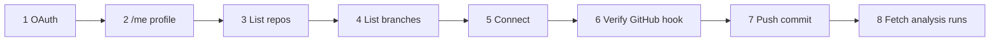

| Step | Action | Success criteria |
|---|---|---|
| 1 | `GET /github/oauth/url` → approve → callback | JWT returned; user in `Clients` |
| 2 | `GET /auth/me`, `GET /github/profile` | Identity matches expected GitHub user |
| 3 | `GET /github/repositories` | Slim repo list |
| 4 | `GET /…/branches` | Slim branch list |
| 5 | `POST /repo-index/connect` | Webhook created **then** index `ready`/`partial` |
| 6 | Check GitHub → Settings → Webhooks | Payload URL = `PUBLIC_WEBHOOK_URL` |
| 7 | Push to connected branch | Webhook `analysisStarted: true` |
| 8 | `GET /analysis/…/runs` | New `completed` run with metrics |

### Ngrok

```bash
ngrok http 3100   # or your PORT
```

Update `.env`:

```env
PUBLIC_WEBHOOK_URL=https://<your-subdomain>.ngrok-free.dev/api/v1/github/webhook
```

Restart Nest, then **connect again** so GitHub’s hook URL is updated. Free ngrok URLs change on restart.

---

## 11. Permissions & webhooks

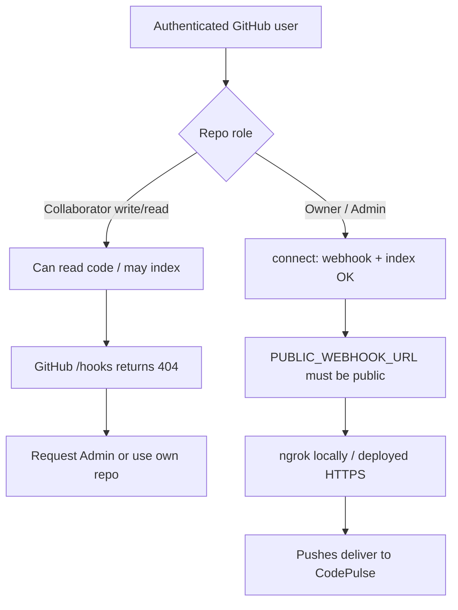

| Action | Minimum GitHub permission |
|---|---|
| List repos / branches / read code | Collaborator with read (typically `repo` scope) |
| Create / list repository webhooks | **Admin** on the repository |
| Receive push events | Hook must be installed by an admin |

Collaborators without admin receive **404** from GitHub’s hooks API (by design). Use a repo you own, or ask an admin to grant Admin / run connect.

Connect order ensures you fail fast on permissions before spending embedding quota.

---

## 12. Project structure

```
code-pulse-be/
├── src/
│   ├── auth/                 # JWT + /me (GitHub-only users)
│   ├── github/               # OAuth, slim DTOs, webhook verify
│   ├── repo-rag/             # Index, chunk, embed, retrieve
│   ├── analysis/             # Push analysis + LangGraph
│   │   └── langgraph/
│   │       ├── graph.ts
│   │       ├── state.ts
│   │       └── node/         # guard, retriever, domains, join, assembler
│   ├── schemas/              # Clients user schema
│   ├── config/               # Env validation
│   └── main.ts
├── .env.example
├── Dockerfile
└── README.md
```

---

## 13. Roadmap

- [x] GitHub OAuth only + encrypted tokens
- [x] Slim repo/branch discover APIs
- [x] Connect = webhook-first then embeddings
- [x] Push webhook → incremental RAG + async analysis
- [x] Multi-agent LangGraph review with measurable report
- [x] Persisted push analysis runs
- [ ] Release notes generation from pushes
- [ ] Dashboard for metric trends (composite rating over time)
- [ ] Optional publish findings back to GitHub (commit status / check run)

---

## Design principles

1. **Webhook before cost** — prove hook permissions before embedding spend  
2. **Deterministic context before AI** — sanitize files and retrieve RAG prior to LLM calls  
3. **Specialized agents over one mega-prompt** — quality / security / performance in parallel  
4. **Measurable outputs** — ratings, severity histograms, coverage, and context counts on every run  
5. **Slim client contracts** — only fields the product needs leave the API boundary  

---

## License

UNLICENSED (private project).
